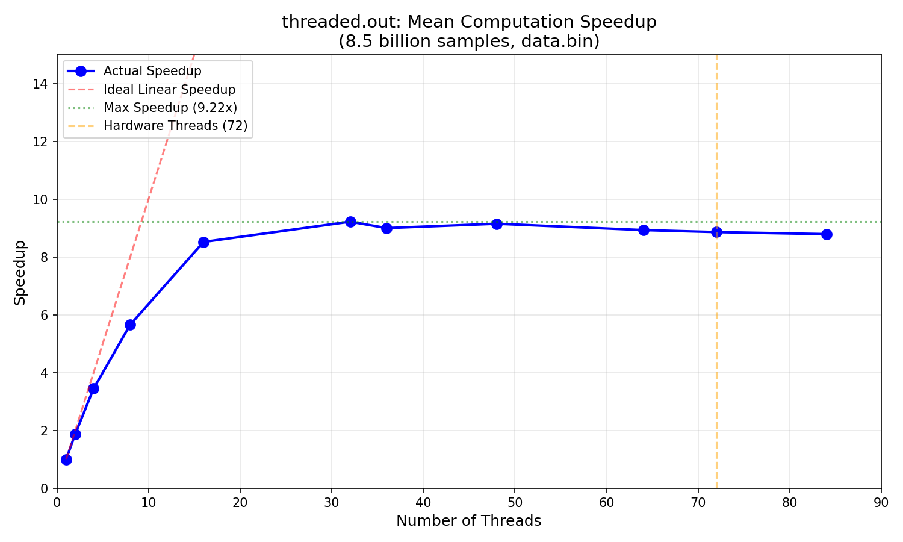
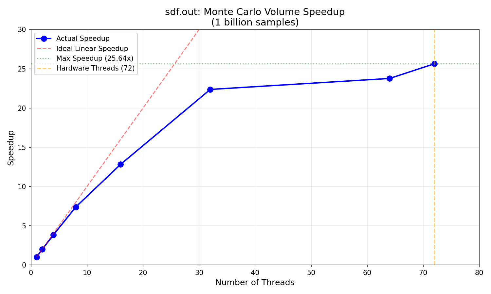

# Project-2: Threading and Multi-Core Applications


## "Computing a Mean" Questions

### Q: Create a graph plotting number of threads along the X-axis and speedup along the Y-axis.



#### Timing Data (data.bin: 8,500,000,000 samples, mean = 52.7128)

| Threads | Time (sec) | Speedup |
|---------|------------|---------|
| 1       | 11.16      | 1.00    |
| 2       | 5.92       | 1.88    |
| 4       | 3.23       | 3.45    |
| 8       | 1.97       | 5.66    |
| 16      | 1.31       | 8.52    |
| 32      | 1.21       | 9.22    |
| 36      | 1.24       | 9.00    |
| 48      | 1.22       | 9.15    |
| 64      | 1.25       | 8.93    |
| 72      | 1.26       | 8.86    |
| 84      | 1.27       | 8.79    |

---

### Q: For the graph, note the shape of the curve. Does it "converge" to some general value? What's the maximum speedup you got from threading? What happens when you use more cores than are available in the hardware?

**Does it converge?** Yes, the curve converges to approximately 9.2×. After about 16-32 threads, the speedup flattens out and adding more threads provides no additional benefit.

**Maximum speedup:** 9.22× at 32 threads.

**What happens past hardware cores (72)?** When using 84 threads (exceeding the 72 hardware threads), the speedup actually decreases slightly to 8.79×. This is due to thread scheduling overhead—the OS must context switch between more threads than there are physical cores, adding overhead without providing benefit.

---

### Q: Considering the number of cores in the system, do you get a linear scaling of performance as you add more cores?

No, scaling is not linear. Linear scaling would give 72× speedup with 72 threads, but we only achieve ~9×. 

The scaling starts near-linear but quickly falls off:
- 2 threads: 1.88× (94% of ideal)
- 4 threads: 3.45× (86% of ideal)
- 8 threads: 5.66× (71% of ideal)
- 16 threads: 8.52× (53% of ideal)
- 32+ threads: ~9.2× (29% of ideal)

This sub-linear scaling occurs because the mean computation is memory-bound—threads spend most of their time waiting for data from RAM, not computing. Memory bandwidth becomes the bottleneck, not CPU cores.

---

### Q: Looking at your graph, what value would you propose for P, and describe how you arrived at that value.

Using Amdahl's Law: `Speedup_max = 1 / (1 - P)`

Since the speedup plateaus at approximately 9.2×:

```
9.2 = 1 / (1 - P)
1 - P = 1/9.2 ≈ 0.109
P ≈ 0.89
```

**I propose P ≈ 0.89 (89%).**

This means 89% of the program is parallelizable (the summation loop), while 11% remains serial (thread creation, barrier synchronization, final reduction, and output). I arrived at this value by observing where the speedup curve plateaus and applying the inverse of Amdahl's formula.

---

### Q: Finally, consider the kernel of the mean computation. How many bytes of data are required per iteration? What's the associated bandwidth used by the kernel? Is that value consistent when you consider threaded versions?

**Bytes per iteration:** 4 bytes (one `float` value per iteration)

**Total data:** 8,500,000,000 × 4 bytes = 34 GB

**Bandwidth calculations:**

| Threads | Time (sec) | Bandwidth (GB/s) |
|---------|------------|------------------|
| 1       | 11.16      | 3.05             |
| 8       | 1.97       | 17.3             |
| 32      | 1.21       | 28.1             |

**Is it consistent?** Yes, the bandwidth scales proportionally with speedup. The ratio of bandwidths (28.1 / 3.05 ≈ 9.2) matches the speedup ratio. This confirms the workload is memory-bound. The plateau at ~28 GB/s represents the practical memory bandwidth limit of the system—multiple threads achieve higher effective bandwidth by having multiple memory requests in flight simultaneously.

---

## "Computing a Volume" Questions

### Timing Data and Speedup Graph



#### Timing Data (1,000,000,000 samples, volume ≈ 0.4764)

| Threads | Time (sec) | Speedup |
|---------|------------|---------|
| 1       | 22.82      | 1.00    |
| 2       | 11.44      | 1.99    |
| 4       | 5.98       | 3.82    |
| 8       | 3.09       | 7.39    |
| 16      | 1.78       | 12.82   |
| 32      | 1.02       | 22.37   |
| 64      | 0.96       | 23.77   |
| 72      | 0.89       | 25.64   |

---

### Q: Do you get similar performance curve to `threaded.out`?

**No, the performance curves are significantly different.**

| Metric | threaded.out | sdf.out |
|--------|--------------|---------|
| Maximum Speedup | 9.2× | 25.6× |
| Plateau Point | ~32 threads | ~72 threads |
| Scaling Behavior | Early plateau | Near-linear longer |

**Why the difference?**

- **threaded.out is memory-bound:** Each iteration reads 4 bytes and does minimal computation (one addition). Threads wait on memory, so memory bandwidth is the bottleneck.

- **sdf.out is compute-bound:** Each iteration generates random numbers and performs many floating-point operations (square roots, multiplications, comparisons). Threads stay busy computing, so CPU cores are the bottleneck.

The Monte Carlo volume computation scales much better because it's "embarrassingly parallel"—each sample is independent and requires no shared memory access during computation.