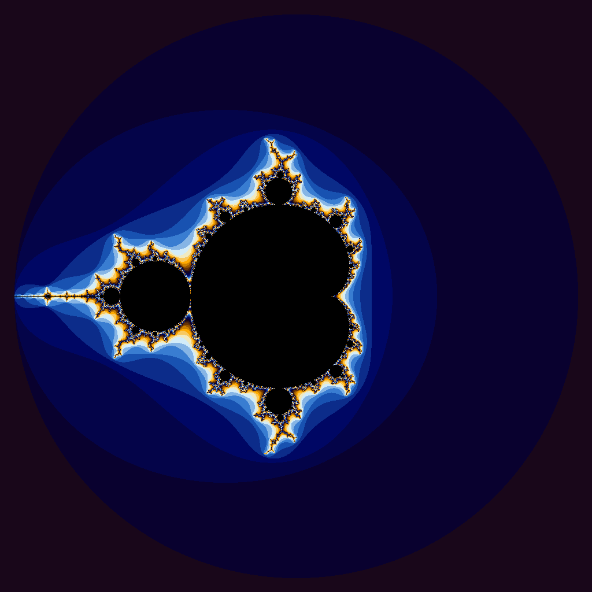

# Project 4: CUDA Programming
---

## Program Descriptions

### iota.cpu
This program is a C++ implementation of the `std::iota` function. It runs on the CPU and fills a vector with increasing values starting from a given value. This is the baseline program that is used to compare against the CUDA implementation.

### iota.gpu
This program is a CUDA implementation of the iota function. Instead of using a loop each GPU thread computes a single element in parallel using the formula values[i] = i + startValue. The global index for each thread is computed by using blockIdx.x * blockDim.x + threadIdx.x.

### julia.cpu
This progam is a C++ implementation that generates a Mandelbrot set image. Each pixel corresponds to a point in the complex plane. The program iterates the equation $z = z^2 + c$ until the value divergences or reaches the maximum number of iterations. The number of iterations before it diverges determines the pixel's color.

### julia.gpu
This program is a CUDA implementation of the julia set generator. Each GPU thread computes one pixel of the image in parallel (independently). Since each pixel involves multiple mathematical operations and there is no shared data, this is a well-suited program for GPU acceleration.

## Timing Results

### CPU iota

|Vector Length|Wall Clock Time|User Time|System Time|
|:--:|--:|--:|--:|
|10| 0.00| 0.00| 0.00|
|100| 0.00| 0.00| 0.00|
|1000| 0.00| 0.00| 0.00|
|10000| 0.00| 0.00| 0.00|
|100000| 0.00| 0.00| 0.00|
|1000000| 0.00| 0.00| 0.00|
|5000000| 0.02| 0.00| 0.02|
|100000000| 0.52| 0.08| 0.44|
|500000000| 2.65| 0.40| 2.24|
|1000000000| 5.33| 0.86| 4.46|
|5000000000|36.98| 5.67|31.30|

### GPU iota

|Vector Length|Wall Clock Time|User Time|System Time|
|:--:|--:|--:|--:|
|10| 0.11| 0.01| 0.09|
|100| 0.10| 0.00| 0.09|
|1000| 0.10| 0.01| 0.08|
|10000| 0.10| 0.01| 0.08|
|100000| 0.09| 0.01| 0.08|
|1000000| 0.11| 0.01| 0.09|
|5000000| 0.13| 0.02| 0.11|
|100000000| 0.69| 0.16| 0.52|
|500000000| 2.98| 0.66| 2.31|
|1000000000| 6.63| 1.94| 4.67|
|5000000000|51.28| 8.35|42.92|

## Analysis

**Are the results what you expected? Speculate as to why it looks like CUDA isn't a great solution for this problem.**

CUDA excels when computation per element is heavy (like the Julia set's iterative loop), when data can stay on the GPU for multiple operations, and when problems are compute-bound rather than memory-bound. The `iota` function meets none of these criteria.

I was surprised that the GPU version of iota was slower than the CPU one pretty much at every vector size. I didn't quite understand why it was slower but then I realized that CUDA has fixed overhead from runtime initialization, memory allocation, and kernel launches. For even small vectors this overhead cost is around .1 seconds which in computing terms is very expensive and makes the GPU slower than the CPU for simple tasks.

The iota function itself does very small compuation where each element only requires addition per element. The bottleneck is the memory bandwidth, not the actual computation. Even though the GPU has thousands of cores to compute it provides no advantage when the limiting factor is how fast the data can be written to memory. Aditionally, data has to be transferred between the CPU and GPU which adds even more overhead. Because of all of these factors, CUDA is not a good solution to this specific problem. GPUs are best when computation per element is heavy and when data can stay on the GPU for multiple operations.

## Julia Set Image

